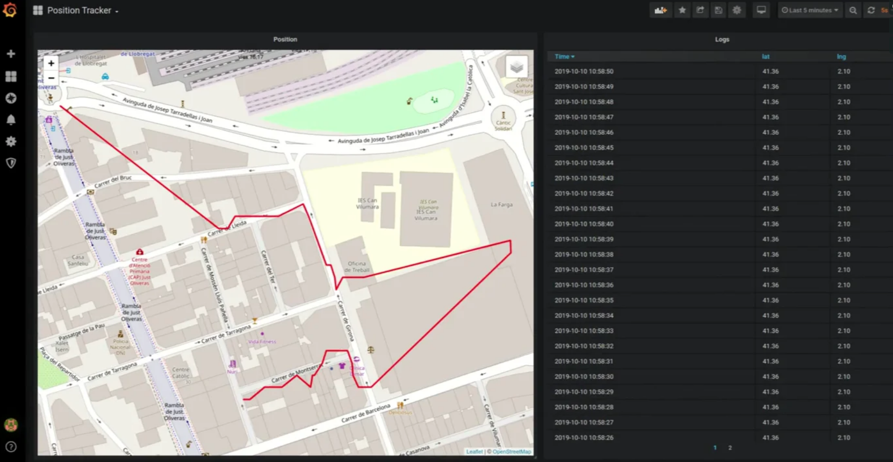

# GPS Live Tracking With Balena, Neo-6M And LoRa!

For some time now, I've been looking for a good excuse to work on a project related to radio communcation.

In this guide, ~~I finally get to do it~~ we will explore how to transmit GPS data wirelessly with the LoRa-02 module and how to visualize that data in real time on a Grafana dashboard!

Full guide [published on my blog](https://kokonatt.com/embedded/gps-live-tracking).

## Table of contents
- [Project overview](https://kokonatt.com/embedded/gps-live-tracking#project-overview)
- [Using the Neo-6M](https://kokonatt.com/embedded/gps-live-tracking#neo-6m)
- [Using the LoRa-02](https://kokonatt.com/embedded/gps-live-tracking#lora-02)
- [Visualization with Balena and Grafana](https://kokonatt.com/embedded/gps-live-tracking#data-visualization)

## A preview of what you can build in this project

### Transmitter device

### Live GPS tracking!
(click to see the video)
